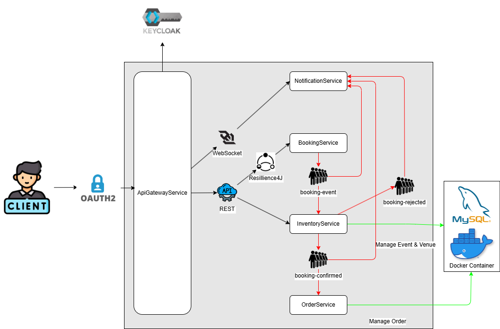

# 💳 Microservice - Order Service

The **Order Service** is a core component of the microservice architecture.  
It manages **customer orders**, processes order creation and updates, interacts with other services through **Kafka**, and persists data in **MySQL**.

---

## 🚀 Overview

This service is responsible for handling the full lifecycle of customer orders.  
It exposes REST endpoints for creating and retrieving orders and consumes events from Kafka to ensure that bookings and inventory stay consistent across the system.

---

## ⚙️ Key Features

- **Spring Boot 3.5.6** – Core microservice framework  
- **Spring Data JPA** – ORM and database management  
- **MySQL** – Relational data storage  
- **Apache Kafka** – Asynchronous communication between services  
- **Java 21** – Runtime language  

---

## 🧩 Architecture Integration

The Order Service is part of a **5-repository microservice ecosystem**:

1. **Common** – Shared DTOs and utilities used across services.  
2. **Booking Service** – Handles booking operations and emits Kafka events.  
3. **Inventory Service** – Manages venue and event stock, consumes booking and order events.  
4. **Order Service** – Handles customer orders and coordinates with booking and inventory services.  
5. **API Gateway** – Central entry point for all external clients, handles routing and authentication via Keycloak.

The Order Service consumes events from **Booking Service** and **Inventory Service** via **Kafka**, ensuring system-wide data consistency, and exposes REST APIs through the **API Gateway**.
